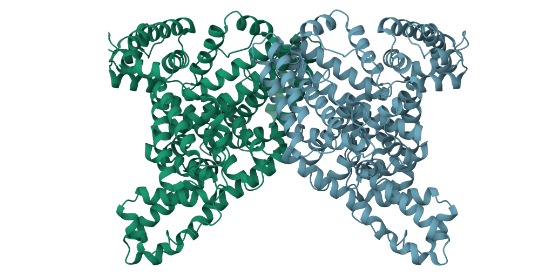
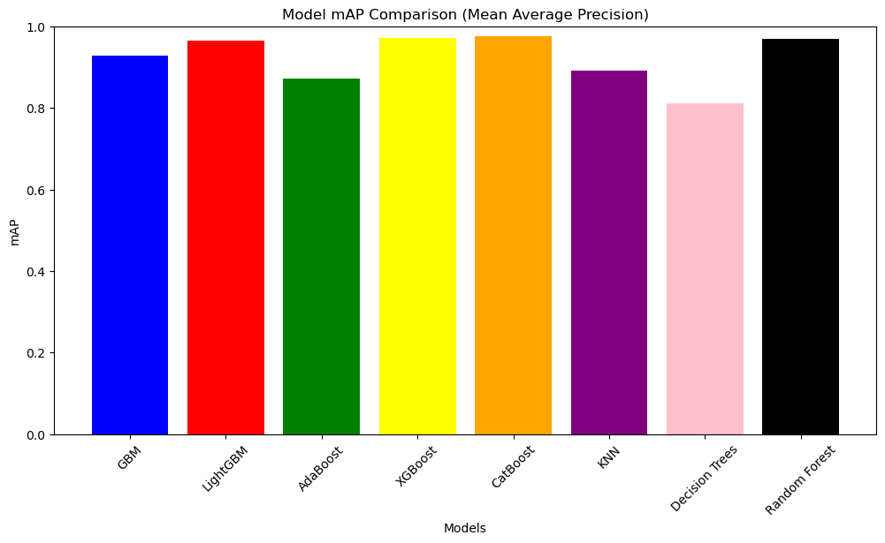

# 🧬 NeurIPS 2024 - Predict New Medicines with BELKA

## Overview
In this competition, we'll develop machine learning (ML) models to predict the binding affinity of small molecules to specific protein targets. This is a critical step in drug development for the pharmaceutical industry, paving the way for more accurate drug discovery. We'll help predict which drug-like small molecules (chemicals) will bind to three possible protein targets.

### Important Dates
- **Start Date:** April 4, 2024
- **Entry Deadline:** July 1, 2024
- **Team Merger Deadline:** July 1, 2024
- **Final Submission Deadline:** July 8, 2024

To download the data, please visit the [Kaggle competition page](https://www.kaggle.com/competitions/leash-BELKA).

## Evaluation
The evaluation metric for this competition is the average precision calculated for each (protein, split group) and then averaged for the final score. Please refer to the [official forum post](https://kaggle.com/competitions/leash-BELKA/discussion) for more details.

## Protein Targets
This competition focuses on predicting the binding affinity of small molecules to three protein targets. Below are the descriptions and images of the three protein targets involved:

### 1. EPHX2 (sEH)
The first target, epoxide hydrolase 2, is encoded by the EPHX2 genetic locus, and its protein product is commonly named “soluble epoxide hydrolase”, or abbreviated to sEH. Hydrolases are enzymes that catalyze certain chemical reactions, and EPHX2/sEH also hydrolyzes certain phosphate groups. EPHX2/sEH is a potential drug target for high blood pressure and diabetes progression, and small molecules inhibiting EPHX2/sEH from earlier DEL efforts made it to clinical trials.

EPHX2/sEH was also screened with DELs, and hits predicted with ML approaches, in a recent study but the screening data were not published. We included EPHX2/sEH to allow contestants an external gut check for model performance by comparing to these previously-published results.

We screened EPHX2/sEH purchased from Cayman Chemical, a life sciences commercial vendor. For those contestants wishing to incorporate protein structural information in their submissions, the amino acid sequence is positions 2-555 from UniProt entry P34913, the crystal structure can be found in PDB entry 3i28, and predicted structure can be found in AlphaFold2 entry P34913. Additional EPHX2/sEH crystal structures with ligands bound can be found in PDB.

.png)

### 2. BRD4
The second target, bromodomain 4, is encoded by the BRD4 locus and its protein product is also named BRD4. Bromodomains bind to protein spools in the nucleus that DNA wraps around (called histones) and affect the likelihood that the DNA nearby is going to be transcribed, producing new gene products. Bromodomains play roles in cancer progression and a number of drugs have been discovered to inhibit their activities.

BRD4 has been screened with DEL approaches previously but the screening data were not published. We included BRD4 to allow contestants to evaluate candidate molecules for oncology indications.

We screened BRD4 purchased from Active Motif, a life sciences commercial vendor. For those contestants wishing to incorporate protein structural information in their submissions, the amino acid sequence is positions 44-460 from UniProt entry O60885-1, the crystal structure (for a single domain) can be found in PDB entry 7USK and predicted structure can be found in AlphaFold2 entry O60885. Additional BRD4 crystal structures with ligands bound can be found in PDB.

### 3. ALB (HSA)
The third target, serum albumin, is encoded by the ALB locus and its protein product is also named ALB. The protein product is sometimes abbreviated as HSA, for “human serum albumin”. ALB, the most common protein in the blood, is used to drive osmotic pressure (to bring fluid back from tissues into blood vessels) and to transport many ligands, hormones, fatty acids, and more.

Albumin, being the most abundant protein in the blood, often plays a role in absorbing candidate drugs in the body and sequestering them from their target tissues. Adjusting candidate drugs to bind less to albumin and other blood proteins is a strategy to help these candidate drugs be more effective.

ALB has been screened with DEL approaches previously but the screening data were not published. We included ALB to allow contestants to build models that might have a larger impact on drug discovery across many disease types. The ability to predict ALB binding well would allow drug developers to improve their candidate small molecule therapies much more quickly than physically manufacturing many variants and testing them against ALB empirically in an iterative process.

We screened ALB purchased from Active Motif. For those contestants wishing to incorporate protein structural information in their submissions, the amino acid sequence is positions 25 to 609 from UniProt entry P02768, the crystal structure can be found in PDB entry 1AO6, and predicted structure can be found in AlphaFold2 entry P02768. Additional ALB crystal structures with ligands bound can be found in PDB.

.png)

## Code Structure
- `notebooks/`: Jupyter notebooks for exploratory data analysis and model training.
- `data/`: Directory to store datasets.
- `images/`: Images and visuals for README and documentation.

## Results
Here, we display some results, visualizations, and metrics achieved during the competition.

### ROC Curve

### Mean Average Precision

## Contributors
- **Utsav Singhal** - [GitHub](https://github.com/UTSAVS26)
<!--
- **Nandani Daga** - [GitHub](https://github.com/Nandanidaga)
-->

## License
This project is licensed under the MIT License - see the [LICENSE](LICENSE) file for details.

## Acknowledgements
- Thanks to Leash Biosciences for organizing the competition.
- Special thanks to the Kaggle community for their valuable resources and support.

🚀 Happy Coding!

